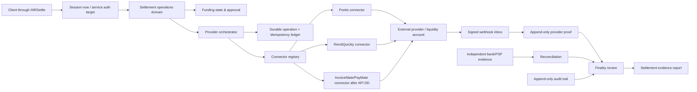

# INRSettle — технический и коммерческий partner-readiness audit

Дата: 20 июля 2026. Ветка исправлений: `codex/provider-readiness-audit`. Репозиторий: `Gatsby01k/INRSettle`.

## 1. Итог без маркетингового смягчения

INRSettle — работающий Next.js/Prisma прототип B2B settlement operations platform. Сильная часть продукта — доказательная модель: provider claim отделён от independent reconciliation, lifecycle и finality вычисляются детерминированно, а отчёт строится из persisted evidence. Это подтверждают `lib/finality.ts`, `lib/finality-input.ts`, `lib/provider-proof.ts`, `lib/reconciliation.ts` и settlement report route.

До аудита репозиторий нельзя было безопасно показывать техническому партнёру как integration-ready:

- README описывал статический Netlify-сайт, хотя приложение — Next.js + PostgreSQL + Prisma (`README.md`, `package.json`, `vercel.json`);
- migration chain создавал enum lifecycle, несовместимый с текущей Prisma-схемой и кодом (`prisma/migrations/20260602102000_canonical_settlement_lifecycle/migration.sql` против `prisma/schema.prisma` и `lib/settlement-lifecycle.ts`);
- REST mutations для quote, settlement и reconciliation не проверяли role capability;
- provider выбирался неявно по приоритету env, не существовало tenant connection, durable outbound operation ledger и durable webhook inbox;
- pre-funding не было отдельным состоянием и могло быть невидимо перед execution;
- `/providers`, `/api-reference`, KYB, monitoring, accounts и counterparties смешивали реальные и фиктивные утверждения;
- cookie auth существовал, но suspended tenant, MFA policy и deterministic membership selection не были полностью enforced;
- security page заявляла больше, чем обеспечивал runtime; security headers отсутствовали;
- raw provider payloads, account identifiers и документы не имеют полноценного enterprise data-protection layer.

После внесённых изменений продукт значительно лучше подготовлен к честной technical discovery session и controlled demo. Он **не готов для первого production-клиента** до закрытия открытых P0 gates в разделе 11. Это не PSP, exchange, payout provider или liquidity provider; код должен презентоваться как control/evidence plane поверх внешних providers.

## 2. Метод и выполненные проверки

Проверены все tracked source files вне `node_modules`/`.next`: App Router pages and routes, Prisma schema и каждая migration, auth/RBAC, domain functions, provider clients, standalone Pontis gateway, seeds, tests, public/legacy HTML и operational docs.

Исходный контрольный прогон:

| Проверка | Исходный результат | Примечание |
|---|---:|---|
| `npm ci` | Pass | 553 packages |
| `npm run typecheck` | Pass | До изменений |
| `npm test` | Pass | 14 files, 194 tests |
| `npm run lint` | Pass with warnings | 7 warnings |
| `npx prisma validate` | Pass | Schema syntax была валидна, но это не проверяет semantic migration drift |
| `npm run build` | Pass только с network | `next/font/google` требовал сеть; также был output-file-tracing warning из legacy HTML renderer |
| `npm audit` | 7 findings | 1 high, 5 moderate, 1 low; high — transitive `hono` через Prisma dev tooling, moderate включают PostCSS/Next/Prisma tree; blind `npm audit fix --force` не применялся |

Финальный контрольный прогон фиксируется в разделе 14 после всех изменений. Реальный provider call не выполнялся: в репозитории нет выданных для этой проверки sandbox credentials, а для InvoiceMate/PayMate нет API contract.

## 3. Карта текущего продукта

### 3.1 Public surface

- `/` — native Next landing (`app/page.tsx`), demonstration metrics явно маркированы.
- `/contact` — native contact/access page (`app/contact/page.tsx`). Ложная Netlify submission удалена: `components/marketing/contact-mail-form.tsx` явно открывает email draft и сообщает, что поля не загружаются в INRSettle. CRM/form backend всё ещё отсутствует, но silent data loss больше не маскируется под успешную отправку.
- `/settings/security` — реальный TOTP enrollment, recovery codes, session step-up и MFA disable/re-auth (`app/(dashboard)/settings/security/page.tsx`, `components/security/mfa-panel.tsx`). Public `/security` остаётся отдельной marketing/control-description page.
- `/sample-report` — статический публичный demonstration report (`app/sample-report/page.tsx`).
- `/use-cases`, `/inr-settlement-india`, `/infrastructure`, `/developers`, `/compliance`, `/security`, `/risk`, `/status`, `/docs/**`, `/legal/**` — Next wrappers над legacy HTML через `components/marketing/static-marketing-page.tsx` и `dangerouslySetInnerHTML` из tracked local files.
- В корне остаются legacy `*.html`, `styles.css`, `script.js`, `analytics.js`; они являются content source/legacy residue, а не отдельным runtime.

Риск: build-time `fs.readFileSync(path.join(process.cwd(), ...))` в `static-marketing-page.tsx` вызывает широкое output tracing и усложняет immutable/container deployments. Status page остаётся placeholder/static, не живой status service.

### 3.2 Authenticated console

Primary navigation определяется `lib/ops.ts`:

| Route | Фактическая функция | Источник данных |
|---|---|---|
| `/dashboard` | queue, metrics, recent settlement/finality state | Prisma |
| `/settlements` | creation, approval, explicit provider/manual execution, provider poll, proof/reconciliation/finality navigation | Prisma + server actions |
| `/settlements/:id/funding` | funding requirement/status/evidence and operation history | Prisma, добавлено аудитом |
| `/settlements/:id/shadow` | proof capture, safety/finality approval, controlled-test view | Prisma + env caps |
| `/settlements/:id/report` | evidence/finality report | Prisma; read causes best-effort `settlement.report_generated` audit write |
| `/quotes` | quote creation/expiry/acceptance | Prisma; rate из `QUOTE_RATE_USDT_INR`, demo fallback только вне production/explicit demo |
| `/reconciliation` | ingest/manual match/auto-match/exceptions/demo utilities | Prisma |
| `/providers` | registered connectors, tenant connections, operation ledger, verified webhook inbox | Prisma + runtime registry; переписано в ходе аудита |
| `/counterparties` | illustrative directory | static `lib/treasury.ts`, не DB/KYB system |
| `/kyb` | illustrative checklist | `lib/kyb/mock.ts`, не enforcement |
| `/monitoring` | illustrative runbook/snapshot | `lib/monitoring/mock.ts`, не telemetry |
| `/pilot-readiness` | illustrative checklist | `lib/pilot-readiness/mock.ts`, не live readiness engine |
| `/audit-logs` | tenant audit browser | Prisma |
| `/reports` | export links/metrics | Prisma |
| `/settings` | organization settings | Prisma |
| `/team` | real memberships plus separate sample roster | Prisma + `DEMO_TEAM` |
| `/accounts` | illustrative treasury references | static `lib/treasury.ts`, не connected balances |
| `/api-reference` | честная карта существующих cookie-session routes и незакрытых API controls | code-backed static description; исправлено |

### 3.3 API routes

Customer/console routes:

- `/api/auth/login`, `/api/auth/logout` — session cookie.
- `/api/quotes` GET/POST — tenant scope; POST теперь RBAC-gated.
- `/api/settlements` GET/POST — tenant scope; POST теперь RBAC-gated.
- `/api/reconciliation` GET/POST — tenant scope; POST теперь RBAC-gated.
- `/api/settings` GET/PATCH — PATCH OWNER/ADMIN.
- `/api/reports` GET — tenant-scoped export, no-store и audit entry.
- `/api/settlements/:id/finality` GET — read-only finality case file.
- `/api/settlements/:id/funding` GET/PATCH — tenant scope; PATCH approver-only, fresh MFA step-up и dual control для FUNDED.
- `/api/provider-connections` GET/PUT — tenant connection metadata; PUT OWNER/ADMIN; credential value не возвращается и принимается только opaque secret reference.
- `/api/security/mfa` POST — session-authenticated enrollment/confirmation/step-up/disable; recovery codes возвращаются один раз.

Provider routes:

- Pontis: test-login, test-payout, status и internal signed webhook callback. Единственный provider-facing static-IP gateway находится в `gateway/pontis`; конфликтующие legacy Next `/pontis/payout|status` routes удалены.
- RemitQuickly: test-payout, order-status, set-webhook, signed webhook.

Оба sandbox mutation surfaces теперь требуют session + role. Settlement execution через test routes идёт в `lib/providers/service.ts`, а не напрямую в connector.

### 3.4 Data model

`prisma/schema.prisma` содержит:

- identity/tenancy: `User`, `Organization`, `Membership`, `OrganizationSettings`;
- core operations: `Quote`, `Settlement`, `SettlementEvent`;
- evidence: `ReconciliationRecord`, `ProviderProof`, `AuditLog`;
- provider foundation: `ProviderConnection`, `ProviderOperation`, `ProviderWebhookEvent`.

Ключевые DB invariants после аудита:

- один quote может породить не более одного settlement (`Settlement.quoteId @unique`);
- provider transaction unique внутри provider (`@@unique([provider, providerTransactionId])`);
- reconciliation external reference unique per tenant/source;
- provider execution/funding operation idempotent per tenant/provider/key;
- webhook event unique per provider/event key;
- provider proof deduplicated по hashed natural evidence key;
- `AuditLog` update/delete блокируется trigger migration `20260720110000_immutable_audit_log`.

## 4. Роли и разделение обязанностей

Source of truth: `prisma/schema.prisma`, `lib/permissions.ts`, `lib/settlement-actions.ts`, server actions и `lib/__tests__/permissions.test.ts`.

| Capability | OWNER | ADMIN | TREASURY_MANAGER | SETTLEMENT_OPERATOR | COMPLIANCE_OFFICER | FINANCE_VIEWER |
|---|---:|---:|---:|---:|---:|---:|
| Create quote/settlement | ✓ | ✓ | ✓ | ✓ | — | — |
| Write/match reconciliation | ✓ | ✓ | ✓ | ✓ | — | — |
| Approve lifecycle | ✓* | ✓* | ✓* | — | — | — |
| Manage/confirm funding | ✓* | ✓* | ✓* | — | — | — |
| Approve LIVE_TEST finality | ✓* | ✓* | ✓* | — | — | — |
| Manage settings/provider connection | ✓ | ✓ | — | — | — | — |
| View audit/reports | ✓ | ✓ | ✓ | ✓ | ✓ | ✓ |

`*` — dual control: creator не может approve собственный settlement; creator также не может подтвердить FUNDED. При `requireMfaForApproval=true` код блокирует unenrolled user.

`User.mfaEnabled` больше не является декоративным marker. `lib/mfa.ts`, `/api/security/mfa`, `/settings/security` и migration `20260720120000_real_mfa_session_assurance` реализуют TOTP, AES-256-GCM secret storage, one-time recovery codes, `authVersion` session revocation и 10-minute step-up для approval/funding/finality. Login без второго фактора после enrollment возвращает challenge и не выдаёт session; пять последовательных password/MFA failures дают 15-minute account lock. Открыто: WebAuthn/admin recovery и distributed IP/device rate limiter.

`COMPLIANCE_OFFICER` имеет helper `canManageCompliance`, но реального flag/hold/release workflow нет. `FINANCE_VIEWER` read-only и теперь получает masked account identifiers/user emails в settlement REST, case detail, report, audit/dashboard/team/settings surfaces. Это не заменяет encryption at rest: settlement accounts и provider payloads в PostgreSQL всё ещё plaintext.

## 5. Settlement lifecycle — фактическое поведение

Основной state machine: `lib/settlement-lifecycle.ts`.

```text
Quote ACTIVE --atomic claim--> Settlement REQUESTED
REQUESTED --second approver + fresh MFA step-up policy--> APPROVED
APPROVED --funding NOT_REQUIRED/FUNDED + explicit connector/manual shadow--> EXECUTING
EXECUTING --provider proof / manual external outcome--> SETTLED or FAILED
SETTLED --MATCHED independent reconciliation only--> RECONCILED
RECONCILED --deterministic proof+reconciliation+audit review--> report/finality-ready
```

Что проверено:

- quote expiry и tenant ownership проверяются в `createSettlement`;
- conditional quote claim + unique `quoteId` закрывают double consumption;
- lifecycle transition re-read, conditional update, event и audit выполняются в serializable transaction;
- прямой transition в RECONCILED запрещён без `allowReconcile`;
- `provider_claim` не считается независимой reconciliation и не может reconcile settlement;
- provider success сначала записывает proof, затем SETTLED; webhook/poll duplicate proof deduplicated;
- reversal не auto-fail: остаётся review-required evidence;
- finality требует completed proof, independent MATCHED reconciliation, amount/currency agreement и approval trail;
- funding state проверяется **до** provider side effect и повторно при APPROVED→EXECUTING.

Неполнота lifecycle:

- enum содержит `QUOTED`, `PENDING_APPROVAL`, `ON_HOLD`, `CANCELLED`, но current creation path их не создаёт, а transition table не даёт operational paths в ON_HOLD/CANCELLED и из них;
- exception case существует в reconciliation, но settlement-level exception/hold/release workflow отсутствует;
- RECONCILED фактически является operational completion; отдельной persisted finality decision/version/signature модели нет, finality approval хранится audit event;
- reconciliation create/confirm/auto-match теперь связывают evidence record, conditional settlement claim, event и audit в одной serializable transaction; конкурентный второй matcher fail-closed;
- report GET имеет side effect (создаёт audit identity), что нежелательно для строго read-only semantics.

## 6. Provider/API integration design

### Реализованный универсальный слой

- `lib/providers/contracts.ts` — normalized connector contract; provider-specific payloads не выходят в orchestrator.
- `lib/providers/registry.ts` — explicit registry; env precedence удалён.
- `lib/providers/service.ts` — pre-side-effect durable `ProviderOperation`, idempotency, tenant connection readiness, uncertain outcome → `REVIEW_REQUIRED`, no blind auto-retry.
- `lib/providers/webhook-inbox.ts` — signature-verified durable inbox, DB dedupe across processes/restarts.
- `ProviderConnection.credentialsRef` — только opaque pointer; plaintext secrets через API запрещены.
- `lib/funding.ts` — funding FSM и funding operation ledger.

InvoiceMate/PayMate намеренно не добавлен: в репозитории нет authoritative docs/schema/credentials. Корректный следующий connector должен реализовать минимум:

1. authentication/secret resolver;
2. funding request/acknowledgement/status mapping;
3. execution request с provider-side idempotency;
4. status polling;
5. signed webhook verification + replay policy;
6. normalized provider reference/UTR/amount/currency;
7. reconciliation statement or event ingest;
8. typed, contract-tested error taxonomy;
9. sandbox/live environment separation;
10. provider DD evidence outside runtime configuration.

### Целевая архитектура



### Недостающее до production connector

- secret-manager resolver и rotation/versioning;
- outbound worker/queue, bounded retries with jitter, dead-letter/replay operator workflow;
- automated replay/cancel/duplicate workflow remains intentionally absent. `/providers`, `lib/providers/resolution.ts` and `/api/provider-operations/:id/resolve` now support the safe subset: status-only sync or dual-control + fresh-MFA no-effect closure; neither path re-submits money movement;
- durable retry/outbox на Pontis gateway для app-unavailable случая; provider→gateway HMAC и отдельный gateway→app HMAC уже разделены, но synchronous forward сам по себе не гарантирует доставку при отсутствии provider redelivery;
- explicit provider environment (`sandbox`/`live`) и live change approval;
- network allowlisting/mTLS where provider supports it;
- reconciliation file/API contract and statement ingest;
- metrics/alerts/SLO from real operation/webhook rows;
- InvoiceMate/PayMate mappings и contract tests после получения docs.

## 7. Enterprise security audit

### Что есть

- bcrypt cost 12 (`lib/auth.ts`);
- signed 8-hour HttpOnly Secure-in-production SameSite=Strict JWT cookie;
- tenant membership revalidated на каждый protected page/API call;
- inactive/suspended organizations rejected;
- centralized role gates for mutation surfaces;
- dual control on critical approvals;
- CSP, HSTS, frame denial, nosniff, referrer and permissions headers (`next.config.ts`);
- provider HMAC constant-time comparison and Pontis timestamp window;
- durable webhook dedupe;
- audit PII/secret-key redaction and DB append-only trigger;
- export no-store headers and export audit event.

### Критические открытые gaps

- TOTP MFA/step-up/recovery/session revocation реализованы; WebAuthn/admin recovery и distributed IP/device throttling отсутствуют;
- нет login throttling, lockout, bot/risk signal, session revocation/rotation or device/session inventory;
- нет service account/OAuth/API key auth, scopes, expiry, rotation и rate limiting;
- `sourceAccount`, `targetAccount`, provider responses, proof raw responses и webhook payloads хранятся plaintext JSON/string; нет field encryption, key rotation или data classification;
- нет object storage, malware scanning, content-type validation, signed URL, document retention/legal hold; фактически document upload отсутствует;
- audit immutability — DB trigger, но не WORM/external hash chain; DB owner всё ещё может disable trigger;
- нет IP/request ID capture в большинстве audit writes;
- нет tenant-aware encryption keys или formal data residency/deletion workflow;
- legacy marketing HTML uses `dangerouslySetInnerHTML`; source tracked/local, но CSP всё равно разрешает `unsafe-inline`;
- dependency tree использует `latest` почти везде, что снижает reproducibility/upgrade control несмотря на lockfile.

## 8. Взгляд потенциального партнёра

### Head of Partnerships

Плюсы: чёткая funds-movement boundary, клиент остаётся в INRSettle workflow, provider можно выбирать явно, funding visibility и evidence report хорошо поддерживают white-label/control-plane narrative.

Что вызовет вопрос: нет productized client onboarding/KYB gate, pricing/volume SLA placeholders в `docs/commercial-partner-terms.md`, нет CRM/lead workflow, нет реальных InvoiceMate facts, static named counterparties/balances были потенциально misleading и теперь помечены illustrative. Contact page теперь честно использует user-controlled email draft вместо недоказанной submission.

### CTO

Плюсы: Prisma model, deterministic state machines, serializable critical transitions, connector contract, durable operation/webhook models, idempotency guards, status recovery.

Что блокирует production approval: отсутствуют service auth, queue/retry worker, secret resolver, encrypted-at-rest PII/provider payloads, staging-clone migration rehearsal, real observability/DR evidence и provider contract tests. Pontis secret topology теперь authoritative, но gateway durable outbox ещё отсутствует.

### Compliance Officer

Плюсы: independent evidence rule, dual control, tenant scope, append-only audit trigger, explicit demo/shadow/live labels, no claim that INRSettle itself is liquidity/provider.

Что блокирует: KYB/screening pages static, no document chain-of-custody, no sanctions/PEP integration, no compliance hold/release, no maker-checker assignment policy beyond creator check, no retention/erasure matrix, plaintext-at-rest PII/provider payloads, legal pages are templates requiring counsel. FINANCE_VIEWER masking снижает UI exposure, но не решает storage control.

## 9. Всё демо, фиктивное, сломанное или вызывающее недоверие

1. `lib/treasury.ts`: named counterparties, accounts and large balances are static demo data. UI теперь маркирует их illustrative; для переговоров лучше не открывать как evidence.
2. `lib/kyb/mock.ts`, `lib/monitoring/mock.ts`, `lib/pilot-readiness/mock.ts`: static snapshots, не live controls. UI labels исправлены.
3. Старый `/providers` делал неподтверждённые заявления о sandbox verification, commercial proposal, WhatsApp evidence, legal entity и prefunding. Экран заменён на реальные catalog/DB/ledger данные.
4. Старый `/api-reference` заявлял `https://api.inrsettle.com/v1` и provisioned API keys без реализации. Экран заменён на фактические cookie-session routes и blockers.
5. `README.md` утверждал static Netlify/no build. Исправлено на Next/Prisma/Vercel/Postgres.
6. `app/contact/page.tsx` использовал Netlify form attributes при Vercel config и отправлял данные в недоказанный backend. Исправлено на явный client-side email draft без server upload; настоящий CRM handler остаётся P1.
7. `/status` — static placeholder, не incident/status integration.
8. Public security/compliance/legal content приходит из legacy HTML и не является доказательством выполненного control или legal approval.
9. `defaultAccountsForCorridor` и provider connectors используют unstructured `sourceAccount`/`targetAccount`; live beneficiary schema/validation отсутствует, sandbox adapters содержат test defaults.
10. Demo helpers в `lib/domain.ts` могут fabricated independent bank records, но server action ограничивает их DEMO mode. Их нельзя использовать в real/shadow evidence.

## 10. Приоритетный план и статус реализации

### P0 — до technical DD/demo

- [x] Исправить lifecycle migration drift без удаления rows.
- [x] Single-use quote и provider reference uniqueness.
- [x] Atomic lifecycle/event/audit writes и concurrent status claim.
- [x] REST RBAC + active tenant enforcement + deterministic membership.
- [x] Explicit provider selection, per-tenant connection gate, durable idempotency ledger.
- [x] Durable verified-webhook inbox and provider proof dedupe.
- [x] Funding visibility/FSM, pre-side-effect funding guard, funding dual control screen/API.
- [x] Security headers, local system font build, audit export hardening.
- [x] Remove/label false provider/API/KYB/account/counterparty claims.
- [x] DB append-only AuditLog trigger and audit payload redaction.
- [x] Run full migration chain and repeated seeds on disposable clean PostgreSQL.
- [x] Transactional reconciliation link + settlement transition under concurrent matchers.
- [x] Real TOTP MFA enrollment/login/recovery, session revocation, approval step-up and account lockout.
- [x] Role-aware account/email masking for FINANCE_VIEWER on primary UI/API/report surfaces.
- [x] Resolve Pontis provider-secret topology with provider→gateway and gateway→app HMAC separation; remove legacy duplicate gateway routes.
- [ ] Rehearse the same migrations on a staging clone and inspect checksums before deployment (one historically broken migration was corrected in-place).
- [ ] Encrypt PII and raw provider payloads at rest; define retention/erasure and key rotation.
- [ ] Add distributed IP/device login throttling and administrative recovery; account lockout alone is not a complete abuse-control layer.

### P1 — до controlled pilot/first client

- [ ] Service accounts/OAuth, hashed credentials, scopes, rotation, rate limits, request idempotency and OpenAPI.
- [ ] Queue/worker, retry classes, backoff, DLQ and Pontis gateway outbox. Safe manual REVIEW_REQUIRED resolution UI/API is implemented; automated execution replay remains prohibited.
- [ ] Provider environment/change approval and secret-manager resolver.
- [ ] Structured beneficiary/account model with validation and masked/reveal access.
- [ ] Real KYB/sanctions/document workflow, signed URLs, AV scan and chain-of-custody.
- [ ] Compliance hold/release and explicit exception ownership/SLA.
- [ ] Real monitoring/alerts/SLO and status page.
- [ ] Contact form handler/CRM with consent and retention.
- [ ] Backup restore, RPO/RTO and incident exercise evidence.

### P2 — scale/commercial hardening

- [ ] Multi-organization chooser and delegated administration.
- [ ] WORM/hash-chained audit export and SIEM integration.
- [ ] Versioned finality decision/signature model and report artifact storage.
- [ ] Bulk/API/CSV reconciliation ingestion with validation and resumability.
- [ ] Provider scorecards generated from real operations and DD evidence.
- [ ] White-label configuration, client-specific policies, billing/volume metering.
- [x] Replace unconstrained top-level `latest` specifications with the exact versions already resolved in `package-lock.json`.
- [ ] Dependency update/remediation policy and advisory closure; current production audit still reports Prisma/Hono and Next/PostCSS advisories.

## 11. Недостающие screens/workflows

Уже добавлены funding review, MFA/security и safe provider-operation resolution routes. Остаются:

- provider connection editor with health test and four-eyes activation;
- provider operation replay/cancel/duplicate adjudication beyond the implemented status-sync/no-effect closure;
- provider webhook failure/replay detail;
- compliance case: flag, owner, hold, evidence request, approve/reject/release;
- real counterparty/KYB record + documents + screening history;
- account/beneficiary registry with masked identifiers and approval;
- service-account/API credential management;
- bulk reconciliation upload/import history;
- notification/escalation center;
- organization switcher;
- versioned finality approval/completion record;
- deployment status/incident page backed by telemetry.

## 12. Checklist для демонстрации партнёру

Не показывать demo как production. Перед встречей:

- [ ] Использовать отдельную demo DB и `NEXT_PUBLIC_DEMO_MODE=true`; никаких client/partner real PII.
- [ ] `npm run lint`, `npm run typecheck`, `npm test`, `npm run build`, `prisma validate` зелёные на exact commit.
- [ ] Применить migration chain к disposable DB; сохранить migration output.
- [ ] Создать два разных пользователя: operator и approver; показать self-approval rejection.
- [ ] Показать quote single-use, settlement lifecycle, funding block, explicit connector selection.
- [ ] Если sandbox credentials отсутствуют, не нажимать provider execution и прямо сказать «connector code exists; external call not verified in this environment».
- [ ] Показать durable operation ledger и webhook inbox только с реальными test events; пустой экран приемлем.
- [ ] Показать provider success как claim, затем independent reconciliation и finality report.
- [ ] Не открывать illustrative Counterparties/KYB/Monitoring как доказательство actual relationship/control.
- [ ] Подготовить authoritative InvoiceMate API/docs/DD question list; не показывать connector как существующий.
- [ ] Объяснить boundary: provider moves/funds externally; INRSettle controls evidence, approvals, visibility and review.
- [ ] Раскрыть open production blockers до того, как партнёр их найдёт.

## 13. Checklist для первых клиентов

Release запрещён, пока каждый mandatory пункт не подтверждён evidence owner:

- [ ] counsel-approved legal/funds-flow/regulatory analysis for actual corridor and roles;
- [ ] customer and provider KYB/DD complete, contracts/SLA/support/escalation signed;
- [x] TOTP MFA/step-up, one-time recovery codes, session revocation and account lockout;
- [ ] distributed IP/device throttling, administrative recovery and service authentication;
- [ ] tenant-isolation tests including cross-tenant negative integration tests;
- [ ] PII/data classification, encryption, masking, retention/deletion and DPA;
- [ ] document storage with malware scan, signed URLs and access audit;
- [ ] secret manager, rotation and environment separation;
- [ ] clean migration + rollback/forward-fix rehearsal, backups and restore test;
- [ ] provider sandbox contract suite and controlled pilot evidence;
- [ ] idempotency/retry/timeout/duplicate/reversal/webhook replay chaos tests;
- [ ] real monitoring, paging, runbooks, RPO/RTO and incident exercise;
- [ ] reconciliation ingest format agreed and tested on partner samples;
- [ ] maker-checker staffing and compliance hold/escalation workflow;
- [ ] penetration test/remediation and dependency/SBOM review;
- [ ] customer acceptance criteria and capped rollout/kill criteria.

## 14. Конкретные изменения и финальный повторный аудит

Изменения в этой ветке:

- migrations: lifecycle restore/invariants, provider integration foundation, immutable audit log, real MFA/session assurance, provider-operation resolution;
- schema: quote single-use, provider reference uniqueness, funding, connections, operations/resolution, webhook inbox, proof dedupe, MFA/session-revocation fields;
- auth/API/RBAC: active tenant, deterministic membership, cookie hardening, route gates, report audit;
- domain: atomic quote claim, lifecycle transitions and reconciliation match/settlement claims;
- provider: generic contract/registry/service, explicit selection, durable operations/inbox, Remit status adapter, proof dedupe, separated Pontis gateway callback trust boundary, status-only/no-effect REVIEW_REQUIRED resolution;
- funding: state machine, API, screen, execution guard, dual control;
- trust/security: headers, audit redaction/trigger, real TOTP MFA and step-up, session revocation, account lockout, role-aware masking, real provider UI, truthful API/static screen labels, corrected README/env template.
- supply chain: all root top-level dependencies/devDependencies pinned to the lockfile-resolved versions; no package upgrade was hidden in this change.

Финальный verification result должен быть заполнен только фактическими повторными командами на итоговом tree:

| Gate | Result |
|---|---|
| Prisma format/validate/generate | Pass |
| TypeScript | Pass |
| Unit/integration tests | Pass — 19 files, 216 tests |
| ESLint | Pass — 0 warnings/errors |
| Next production build | Pass — 48 generated page units; one known NFT tracing warning from legacy `fs` HTML renderer |
| Pontis gateway typecheck/build | Pass after clean `npm ci` |
| Clean PostgreSQL migrations + seed | Partial after latest change — migrations 1–11, base seed and two demo resets passed on clean PostgreSQL; migration 12 (`20260720130000_provider_operation_resolution`) passed Prisma format/validate/generate and transactional tests but its DB deploy rerun was blocked by the local execution-tool approval limit. Must be clean-deployed before claiming this gate Pass again. |
| Local HTTP smoke | Pass — earlier product routes plus `/settings/security` 200; MFA enrollment/confirm 200; enrolled login without code 202/no session; one-time recovery login 200 then replay 401; security headers present |
| Production dependency audit | Fail gate — app reports 6 advisories (1 high, 5 moderate) in Prisma/Hono and Next/PostCSS trees; gateway 0. Forced breaking downgrade was not applied |

Clean migration testing first exposed PostgreSQL `22P02` in `20260602102000_canonical_settlement_lifecycle`: it wrote `CREATED` before casting the old enum columns to text. The operation order is corrected and the full chain now passes. Because this edits a historical migration, any existing environment that recorded its previous checksum must be inspected and given an explicit baseline/resolve plan before deployment; do not run `migrate deploy` blindly.

Финальный verdict не должен повышаться до «first-client ready», пока открытые P0/P1 controls не закрыты фактическими artifacts, а не текстом в интерфейсе или документе.
